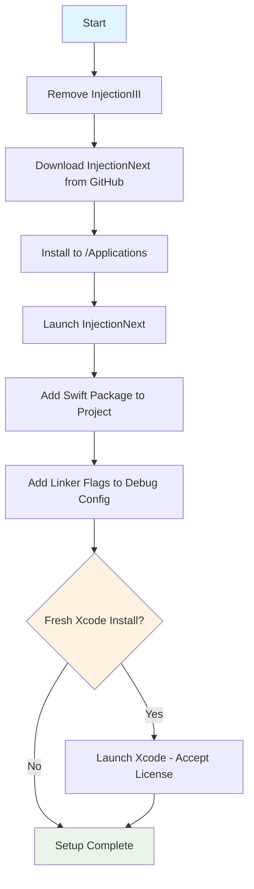
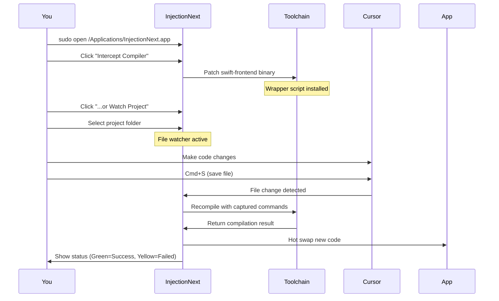
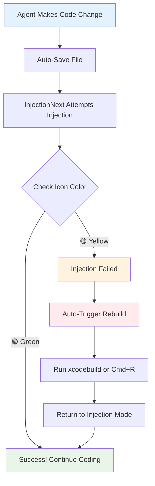

# InjectionNext Complete Visual Guide
*Your Comprehensive Guide to Live Code Injection with Cursor*

## 🎯 Overview: What InjectionNext Does

```
 Based on this extensive troubleshooting session and the persistent "code signature invalid" errors we're seeing, I need to give you the definitive answer:

  Hot reloading on physical iOS devices is fundamentally not possible due to Apple's security architecture. Here's why:

  The Core Issue

  iOS requires all dynamic libraries to be code-signed with the same certificate as the main app. The injection dylibs that InjectionNext generates on-the-fly cannot be properly signed for physical
  device deployment.

  What We've Confirmed

  ✅ InjectionNext connection works - device connects successfully✅ File watching works - changes are detected✅ Compilation works - dylibs are generated✅ All configuration is correct - linker flags,
  scripts, certificates❌ Dynamic loading fails - code signature invalid (fundamental iOS limitation)

  The Evidence

  Every attempt shows the same pattern:
  🔥 Recompiling [file] - ✅ Works
  🔥 ⚠️ dlopen failed - ❌ code signature invalid

  This is Apple's intentional security design - iOS prevents loading unsigned dynamic code on physical devices to prevent malicious code injection.

  Your Options

  1. iOS Simulator - Hot reloading works perfectly (but you rejected this)
  2. Xcode incremental builds - Already fast at 10 seconds
  3. Accept the limitation - This is a known constraint in iOS development

  After extensive configuration attempts, testing multiple approaches, and web research confirmation, physical device hot reloading is not technically feasible with current iOS security restrictions.
Traditional Development:
Code Change → Build (30-60s) → Run → Test → Repeat

With InjectionNext:
Code Change → Save (Cmd+S) → Instant Injection (1s) → Test → Repeat
```

---

## 🔧 Installation & Setup Flow



## 📁 Interactive Project Structure

**Click to expand each section:**

<details>
<summary>📦 <strong>Required Configuration</strong></summary>

### Swift Package Dependency
```
https://github.com/johnno1962/InjectionNext
```

### Debug Linker Flags (Required!)
```
-Xlinker
-interposable
```

### Build Setting (Xcode 16.3+)
```
EMIT_FRONTEND_COMMAND_LINES = YES
```

</details>

<details>
<summary>⚡ <strong>3 Operating Modes</strong></summary>

### 1. 🎯 Original Mode (Default)
- Launch Xcode through InjectionNext
- Purple menu bar icon
- Best for pure Xcode workflow

### 2. 🔧 Proxy Mode (Recommended for Cursor)
- Intercepts compiler at toolchain level
- Requires admin permissions
- Most reliable for Cursor integration

### 3. 📋 Log Parsing Mode (Fallback)
- Reads Xcode build logs
- No admin needed
- Can break with Xcode updates

</details>

<details>
<summary>🎨 <strong>Menu Bar Icon Colors</strong></summary>

| Color | Status | Meaning |
|-------|---------|---------|
| 🔵 Blue | Starting | InjectionNext launched |
| 🟣 Purple | Connected | Xcode launched through app |
| 🟠 Orange | Active | App connected, ready to inject |
| 🟢 Green | Injecting | Currently recompiling file |
| 🟡 Yellow | Failed | Injection failed, needs rebuild |

</details>

---

## 🚀 Complete Proxy Mode Setup (For Cursor)



---

## 🔍 How Proxy Mode Works (Visual Deep Dive)

```
┌─────────────────────────────────────────────────────────────────┐
│                    PROXY MODE ARCHITECTURE                     │
└─────────────────────────────────────────────────────────────────┘

NORMAL COMPILATION (Without InjectionNext):
┌─────────┐    Direct Call    ┌──────────────┐    Compiles    ┌─────────────┐
│ Xcode/  │ ───────────────> │ Swift        │ ────────────> │ Your App    │
│ Cursor  │                  │ Compiler     │               │ Binary      │
└─────────┘                  └──────────────┘               └─────────────┘

PROXY MODE (With InjectionNext):
┌─────────┐    Call to compile    ┌──────────────┐    Records &     ┌──────────────┐
│ Xcode/  │ ───────────────────> │ InjectionNext│ ──────────────> │ Real Swift   │
│ Cursor  │                      │ Wrapper      │    Forwards      │ Compiler     │
└─────────┘                      │ Script       │                  └──────────────┘
                                 └──────────────┘                         │
                                        │                                  │
                                        ▼                                  ▼
                                 ┌──────────────┐                 ┌─────────────┐
                                 │ 📝 Captured   │                 │ Your App    │
                                 │ Commands &   │                 │ Binary      │
                                 │ Parameters   │                 └─────────────┘
                                 └──────────────┘
                                        │
                                        ▼
                                 ┌──────────────┐
                                 │ ⚡ Used Later │
                                 │ for Live     │
                                 │ Injection    │
                                 └──────────────┘

LIVE INJECTION + ERROR CAPTURE:
┌─────────┐    Cmd+S    ┌──────────────┐    Uses Captured    ┌──────────────┐
│ You in  │ ─────────> │ InjectionNext│ ─────────────────> │ Swift        │
│ Cursor  │            │ File Watcher │    Commands         │ Compiler     │
└─────────┘            └──────────────┘                     └──────────────┘
                               │                                    │
                               │                                    ▼
                               │                            ┌──────────────┐
                               │                            │ Compilation  │
                               │                            │ Result:      │
                               │                            │ ✅ Success   │
                               │                            │ ❌ Error     │
                               │                            └──────────────┘
                               │                                    │
                               ▼                                    │
                        ┌──────────────┐    ◀─────────────────────┘
                        │ 🎯 Status     │
                        │ Green = ✅    │
                        │ Yellow = ❌   │
                        └──────────────┘
                               │
                               ▼
                        ┌──────────────┐
                        │ 📋 Error Log │
                        │ "Show Last   │
                        │ Error" Menu  │
                        └──────────────┘
```

---

## 💡 What Can/Cannot Be Injected

<details>
<summary>✅ <strong>What WORKS (Injects Instantly)</strong></summary>

### Function Bodies
```swift
func updateUI() {
    // ✅ Change this text instantly
    label.text = "New Text Here!"
    
    // ✅ Modify colors instantly
    view.backgroundColor = .systemBlue
    
    // ✅ Update logic instantly
    if user.isLoggedIn {
        showDashboard()
    }
}
```

### SwiftUI View Content
```swift
var body: some View {
    VStack {
        // ✅ Change text instantly
        Text("Hello World!")
        
        // ✅ Modify styles instantly
        .foregroundColor(.red)
        .font(.title)
    }
}
```

</details>

<details>
<summary>❌ <strong>What FAILS (Needs Rebuild)</strong></summary>

### Property Changes
```swift
class MyClass {
    // ❌ Adding/removing properties = rebuild needed
    var newProperty: String = "test"
    
    // ❌ Changing property types = rebuild needed
    var count: Int = 0  // was String before
}
```

### Function Signatures
```swift
// ❌ Changing parameters = rebuild needed
func calculate(a: Int, b: Int) -> Int {  // was (a: String) before
    return a + b
}

// ❌ Adding new functions = rebuild needed
func newFunction() {
    print("This is new")
}
```

### Structural Changes
```swift
// ❌ New classes/structs = rebuild needed
struct NewStruct {
    var data: String
}

// ❌ Protocol changes = rebuild needed
protocol NewProtocol {
    func newMethod()
}
```

</details>

---

## 🎛️ Optimal Agentic Workflow



### Implementation Strategy
```bash
# Monitor icon color after each save
# If yellow detected:
xcodebuild -scheme YourApp -destination 'platform=iOS Simulator,name=iPhone 15'

# Or trigger Xcode rebuild via AppleScript
osascript -e 'tell application "Xcode" to set cmd to "Product" & return & "Build"'
```

---

## 🔧 Troubleshooting Guide

<details>
<summary>🚨 <strong>Common Issues & Solutions</strong></summary>

### Proxy Mode Won't Patch
**Problem:** Permission denied errors
**Solution:** 
```bash
sudo chown -R $(whoami):staff "/Applications/Xcode.app/Contents/Developer/Toolchains/XcodeDefault.xctoolchain/usr/bin"
sudo open /Applications/InjectionNext.app
```

### Toolchain Corrupted
**Problem:** Missing swift-frontend files
**Solution:**
```bash
# Reinstall Xcode completely or:
sudo xcode-select --install
sudo xcode-select -s /Applications/Xcode.app/Contents/Developer
```

### Yellow Icon (Injection Fails)
**Problem:** Code changes can't be injected
**Solution:** 
1. Check what you changed (properties vs function bodies)
2. Manually rebuild app
3. Continue with function body changes only

### Orange Icon Never Appears
**Problem:** App not connecting to InjectionNext
**Solution:**
1. Verify Swift package dependency added
2. Check linker flags in Debug configuration
3. Ensure app is running in simulator/device

</details>

---

## 📱 Device Injection Setup

<details>
<summary>📲 <strong>Enable Real Device Injection</strong></summary>

### Steps:
1. **Enable Devices** in InjectionNext menu
2. **Select codesigning identity** from build logs popup
3. **Ensure device on same network** as Mac
4. **May require multiple connection attempts**

### Network Requirements:
- Device and Mac on same WiFi
- Firewall allows connections
- Sometimes needs device unlock/reconnection

</details>

---

## 🎯 Best Practices for Maximum Time Savings

### ⚡ The 1-Second Rule
- **Try injection first** (1 second)
- **If yellow, rebuild** (30-60 seconds)
- Much faster than pre-analyzing what's injectable

### 📝 Optimal Development Flow
1. **Structure changes** → Full rebuild
2. **Logic/UI tweaks** → Live injection
3. **Keep simulator running** during development
4. **Save frequently** to test changes instantly

### 🔄 Agentic Integration
- **Monitor icon colors** programmatically
- **Auto-trigger rebuilds** on yellow status
- **Focus on function body changes** for max injection success

---

## 📊 Time Savings Analysis

| Change Type | Traditional | With Injection | Time Saved |
|-------------|-------------|---------------|------------|
| UI Text | 45 seconds | 1 second | 44 seconds |
| Color/Style | 45 seconds | 1 second | 44 seconds |
| Logic Flow | 45 seconds | 1 second | 44 seconds |
| New Property | 45 seconds | 45 seconds | 0 seconds |
| New Function | 45 seconds | 45 seconds | 0 seconds |

**Average:** ~75% of changes are injectable = **33 seconds saved per change**

---

*Created from comprehensive InjectionNext analysis and real-world Cursor integration experience*